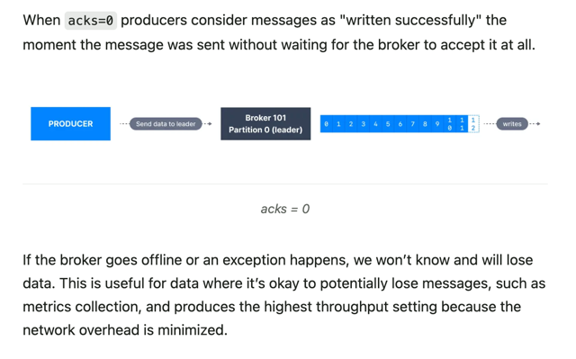

## Steps to create producer
* Create Producer properties
* Create Producer
* Send Data
* Flush and close the producer

## Producer 
#### Sticky Partitioner(NOT RECOMMENDED IN PROD as we can to have it follow stickyPartition - IMPROVES NETWORK EFFICIENCY)
* Since Kafka 2.4, the Sticky Partitioner became the default for the Java Kafka client.

* When sending msg if multiple msg are send quickly, producer will accumulate msg as much as possible and send in batch when its full and then switch to new batch, leading to sending to all msg to same partition rather than doing ***RoundRobin**(each msg to different partition)*

* Improves network efficiency as less travel is done.

## Run multiple instance of consumer
 * Edit configuration -> Allows multiple instance
 * This way you can run multiple instance and see rebalance of kafka in action

## Rebalance
* Kafka default rebalance strategy is eager(round robin, stickyPartitioner, )
* Eager rebalance works like this,
`  eg: Topic(sales_events) has 3 partition and only 2 consumer ( Cnsmr A: prt 1) and (Cnsmr B: prt 2,0) 
`  
    * When **new consumer joins**, for a `very minimal seconds all consumers leave the assigned partition `they were assigned and `rejoins`
    * **`See, this can cause problem`** if num of consumer are high as `data might be lost` during the process
      _**all consumer leaving the group ->  rejoining -> new partition getting assigned (assigned randomly)**_
    * No guarantee, same partition will be assigned when rejoined and assigned during rebalancing
  
## Kafka CLI Cmd
### Connects to conduktor.io

 ### Setup the $PATH environment variable
*  In order to easily access the Kafka binaries, you can edit your PATH variable by adding the following line (edit the content to your system) to your system run commands (for example ~/.zshrc if you use zshrc):

``` PATH="$PATH:/Users/user-name/2.13-3.9.0/bin" ```

* Start Kafka in docker
curl -L https://releases.conduktor.io/quick-start -o docker-compose.yml && docker compose up -d --wait && echo "Conduktor started on http://localhost:8080"


* Create Topic	
```python
kafka-topics.sh --bootstrap-server localhost:19092 --topic consumer-grp-topic-23 --create --partitions 3 --replication-factor 1
```


* Produce msg default mode(sends to same partition from CLI / round robin from Java client)	
```python
kafka-console-producer.sh --bootstrap-server localhost:9092 --topic order_events
```


* Produce msg in round robin	
```python
kafka-console-producer.sh --bootstrap-server localhost:19092 --producer-property partitioner.class=org.apache.kafka.clients.producer.RoundRobinPartitioner --topic topic-to-test-roundRobbin
```

* Produce msg with key separated by “ : “
```python
kafka-console-producer.sh --bootstrap-server localhost:19092 --topic first_topic --property parse.key=true --property key.separator=:
```

* Consumer simple cmd with no metadata (partition name, key, value…etc)	
```python
kafka-console-consumer.sh --bootstrap-server localhost:19092 --topic truck-gps
```

* Consumer from beginning with metadata.	
```python
kafka-console-consumer.sh --bootstrap-server localhost:19092 --topic topic-to-test-roundRobbin --formatter kafka.tools.DefaultMessageFormatter --property print.timestamp=true --property print.key=true --property print.value=true --property print.partition=true --from-beginning
```

* Consume msg from that group and be part of that group or join (if group does not exist, new one is created)	
```python
kafka-console-consumer.sh --bootstrap-server localhost:9092 --topic first_topic --group my-first-application 
```

* Consumer group describe in detail
```python
kafka-consumer-groups.sh --bootstrap-server localhost:19092 --group consumer-grp-for-23 --describe
```

* Reset offset dry run(not executed yet-shows how output would be if executed)	
```python
kafka-consumer-groups.sh --bootstrap-server localhost:19092 --group grp-v3 --reset-offsets --to-earliest --topic tpc-consmr-grp --dry-run
```

* Actually run the reset offset
```python
kafka-consumer-groups.sh --bootstrap-server localhost:19092 --group grp-v3 --reset-offsets --to-earliest --topic tpc-consmr-grp --execute
```

*Note: There are multiple way to reset offset-> specific timestamp, from beginnin, etc*
	
----    
### Run kafka without zookeeper on local(KRAFT MODE)

* The first step is to generate a new ID for your cluster
```python
~/kafka_2.13-3.9.0/bin/kafka-storage.sh random-uuid
```
This returns a UUID, for example 76BLQI7sT_ql1mBfKsOk9Q

* Next, format your storage directory (replace <uuid> by your UUID obtained above)
```python
~/kafka_2.13-3.9.0/bin/kafka-storage.sh format -t <UUID> -c ~/kafka_2.13-3.9.0/config/kraft/server.properties
```
This will format the directory that is in the log.dirs in the config/kraft/server.properties file (by default /tmp/kraft-combined-logs)


* Launch the broker itself in daemon mode by running this command
```python
~/kafka_2.13-3.9.0/bin/kafka-server-start.sh ~/kafka_2.13-3.9.0/config/kraft/server.properties
```
* List all available topics
```python
kafka-topics.sh --bootstrap-server localhost:9092  --list
```
## Producer Acknowledgement


### Ack Types:
* **acks = 0** , sends msg and does not wait for leader or any replica to acknowledge (possible data loss)

* **acks = 1** , sends msg and wait for only the leader to acknowledge(limited data loss)

* **acks = -1(all)** , sends msg and wait for leader & all replica present to acknowledgement (no data loss)


### min.insync.replicas (feature that goes hand in hand with acks - adds guarantee and avoid data loss)
* acks = -1 and min.insync.replicas(ISR) = 2
  * implies that leader and atleast 2 insync replica should be available to 
   accept the msg or else msg are not even accepted by broker
  * _NotEnoughReplicasException_ is returned as response when insync replica number does not match

  
* **Scenario 1**: 
  ` reflicaton factor = 3, acks = all, ISR = 1`
    * Only one broker , _**i.e. leader needs to have data**_
    * **Why leader?** Leader is part of ISR. It first process the msg & then replica gets data form leader,
    in this scenario we have only ISR as 1 , so only leader needs to send acknowledgement
    * 2 broker can loss can be handled

* **Scenario 2:**
  ` reflicaton factor = 3, acks = all, ISR = 2`
  * 1 leader and 1 replica needs to have data or send acknowledgement
  * 1 broker loss can be handled


#### Note: 
*   High Throughput :  How many transaction or query system can handle.
`eg: DB with high throughput means it can handle large amount of query or perform I/O operations
`
*  Acknowledgement : Broker/replica have the data that was sent

## Producer Retries
* Safe Producer : **ENABLED** by default for kafka **VERSION > 3.0**. Producer is **SAFE** (printed on Intellij Console if want to check)
  * Following properties are set by default, if using version < 3.0 set the below property in propertyConfig
    `eg:      properties.setProperty(ProducerConfig.ENABLE_IDEMPOTENCE_CONFIG, "ture");
    properties.setProperty(ProducerConfig.ACKS_CONFIG, "all");`
    * enable.idempotence : setting for producer,  **(Avoid duplicate)** in case of retries, there is chance of duplicate record.
    This property make sure if a producer sends a msg and any network error happens such as error
    during sending acknowledgement, with this feature kafka will not process msg again instead only send acknowledgement
    * delivery.timeout.ms:  timeout period from moment msg are send to kafka
    * max.in.flight.requests.per.connection : number of unacknowledged requests (i.e., requests sent by the client but not yet acknowledged by the server) that can be in-flight (outstanding) per connection to a Kafka broke
      * eg: up to 5 requests can be sent before the producer waits for an acknowledgment for the earliest one.
    * retries 
    

## Wikimedia
### Real world example

* Wikimedia Data Stream (real time recent changes on Wikimedia) : `https://stream.wikimedia.org/v2/stream/recentchange
`
* UI to visualize: `https://esjewett.github.io/wm-eventsource-demo/`

### Producer Flow (Receive data from wikimedia and produce to kafka)
* First code initialize the setup for events
  * such as source url, where to send data, etc
* Then, Impl class **onMessage() method keeps listening** for event
and sends to kafka. Method is async
* Note
  * initialization does not happen for every new even in stream, we setup once and listener takes care of the rest.
  * eg: NOT INITIALIZED FOR EVERY NEW EVENT
  `EventHandler eventHandler = new WikiMediaEventChangeHandlerImpl(producer, topic);
     String url = "https://stream.wikimedia.org/v2/stream/recentchange";
     EventSource.Builder builder = new EventSource.Builder(eventHandler, URI.create(url));
     EventSource eventSource = builder.build();`


### Dependencies required
* OkHttp3
* OkHttp EventSource

## Questions
1) Why flush() and close() method are important?
* without those methods, producer might send not send msg and exit the program.

*   producer.send() method does not send the msg right away to kafka, puts the msg in queue as producer has buffer where it tries to bundled msg together and send in batches.
*   flush(): we say hey send all msg that is in buffer immediately to kafka and blocks the program until done.
*   close(): cleanup - free resources, etct. internally calls flush(), we did mention in code to explain flush() usage, flush() is optional.
